### Procedure

1. Click on the Objective icon 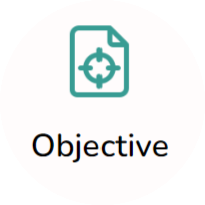 to view the objective of the simulation.

   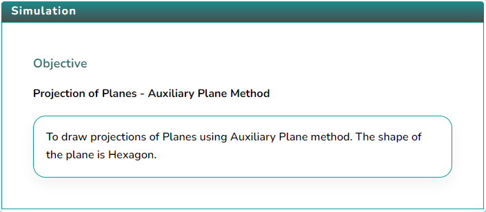

2. Click on the Apparatus icon 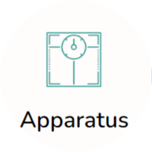 to check the tools required for this simulation.

   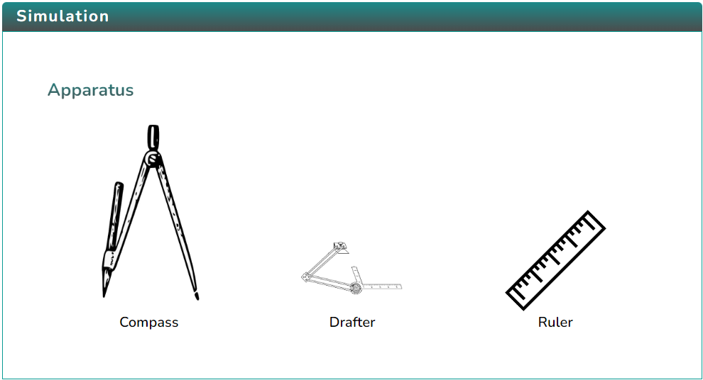

3. Click on the Solution icon  to proceed with further simulation steps.

4. Answer the questions that are either based on the data or are from the procedure of the experiment.  
   Answer the question to initiate the simulator, i.e., to draw the axis.

   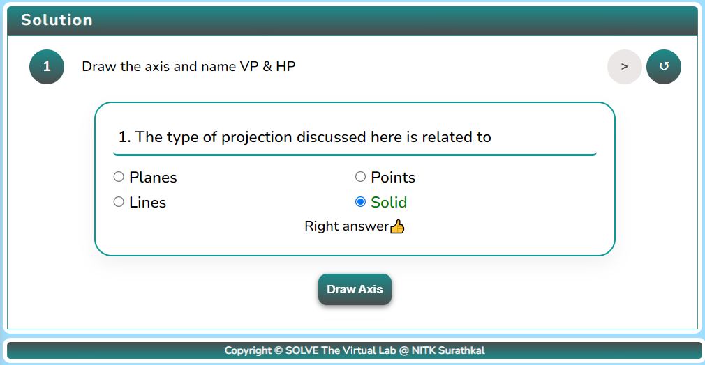

5. After drawing the axis, mark HP and VP.

   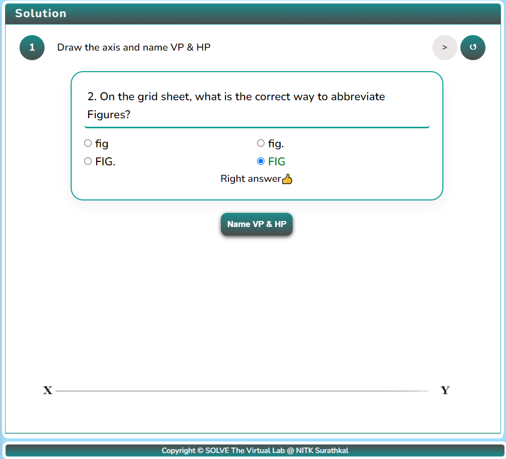

6. Click the “Next Button” and the “Top View” button to draw the top view of the solid.

   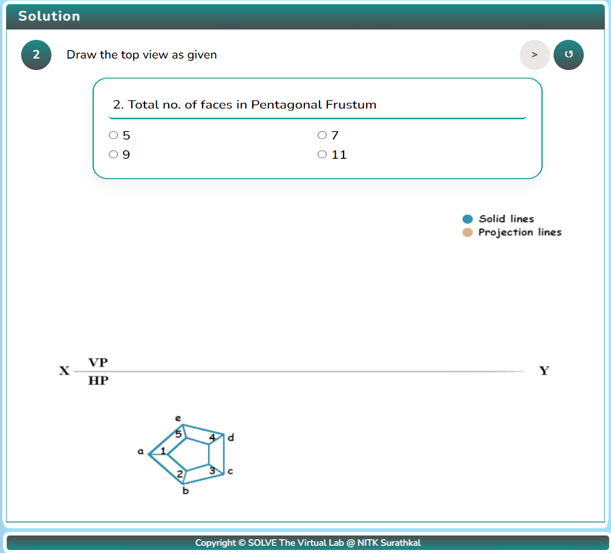

7. Click the “Draw Front View” button to draw the front view of the solid.

   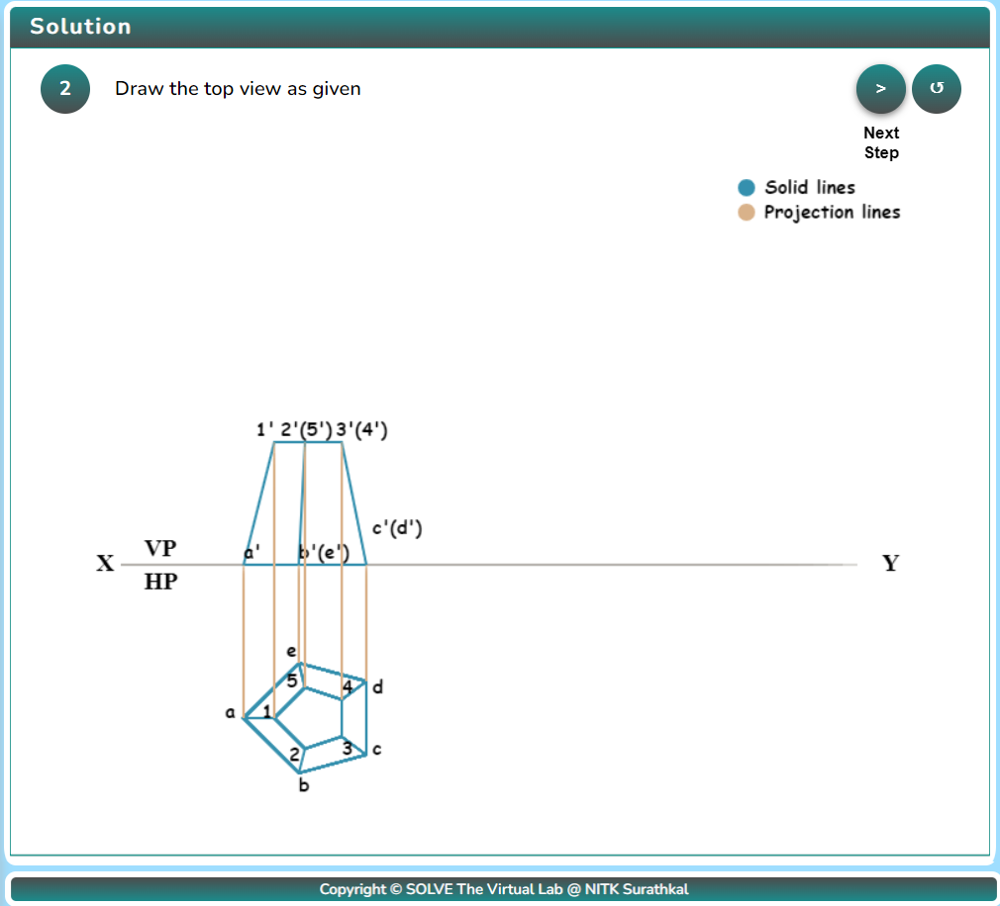

8. Click the “Next Step” and the “Draw AIP” button to get the Auxiliary Inclined Plane

   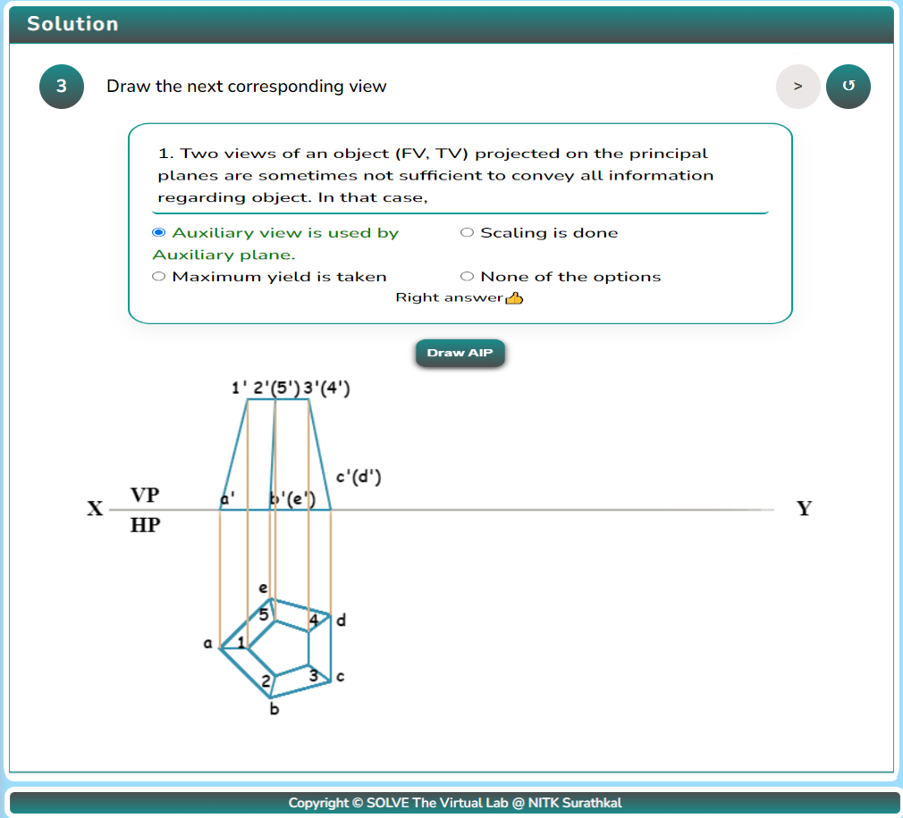

9. Click the “Next Step” and “Mark points” button to mark the points of the solid

   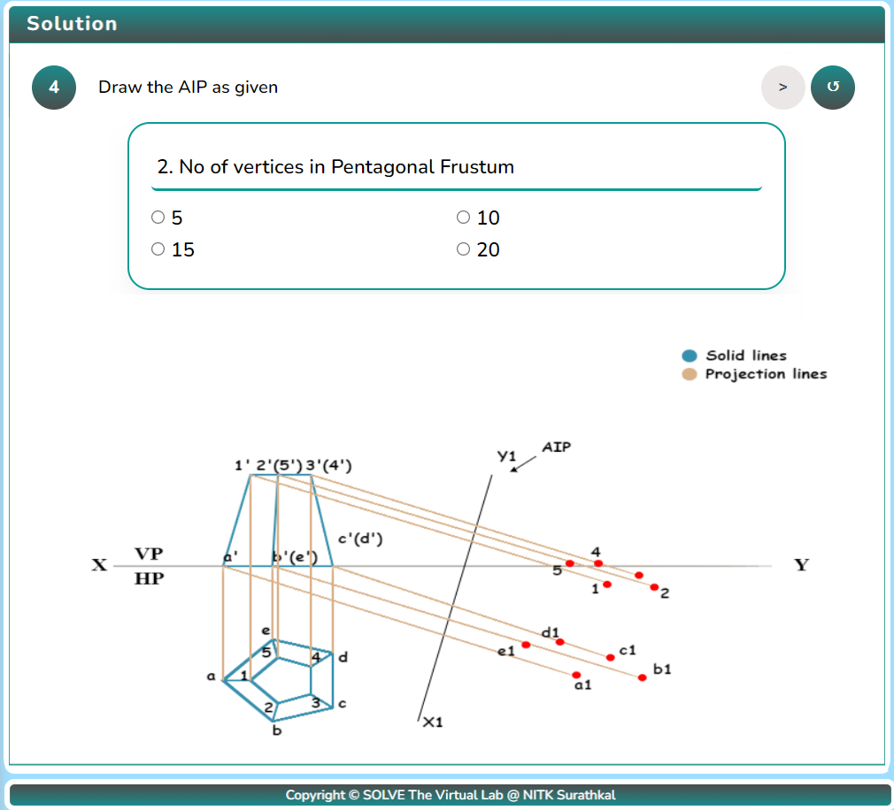

10. Click the “Show final view” button to end the simulation.

    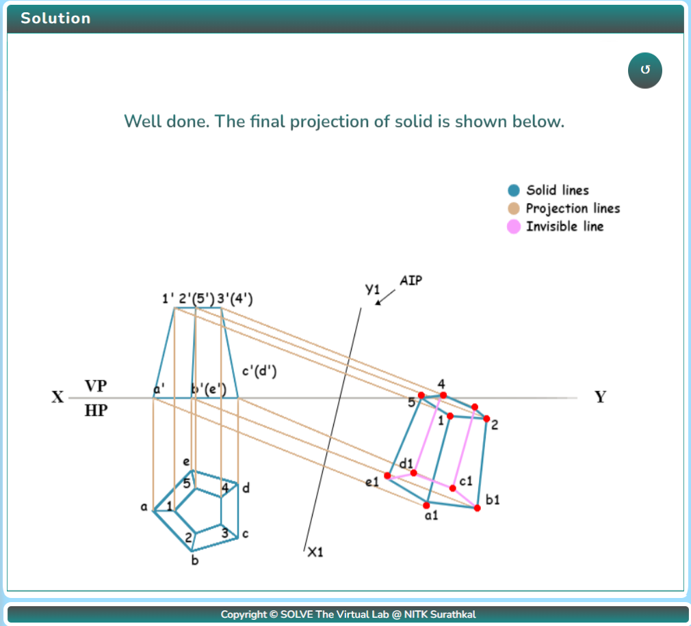

11. After performing the experiment, click on the Reset button  to restart the experiment.
