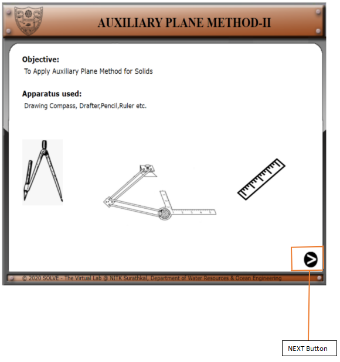
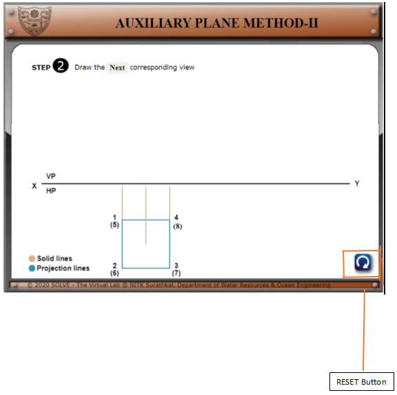
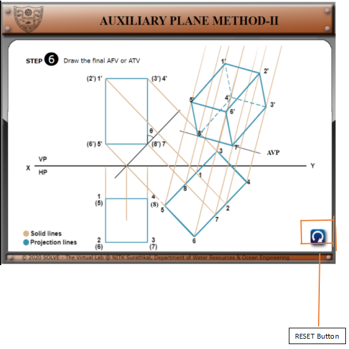

1).Click on **“Auxiliary Plane method II”** the following window will
open. Click on **the NEXT** button to proceed.

2). By Pressing the Button highlighted you can proceed to the next
    step of construction.  
    Hereby pressing 8 We proceed to Step 2.  

3)  **. Here similarly by pressing NEXT we proceed to step 3.  
    In the right-hand corner, a Reset button** 
    **gets active here.**

**4). Finally, after following all the steps, we reach to the final
projection.**

**5). At any step in between, if Reset button** 
**gets clicked, the whole board resets to Step1.**

