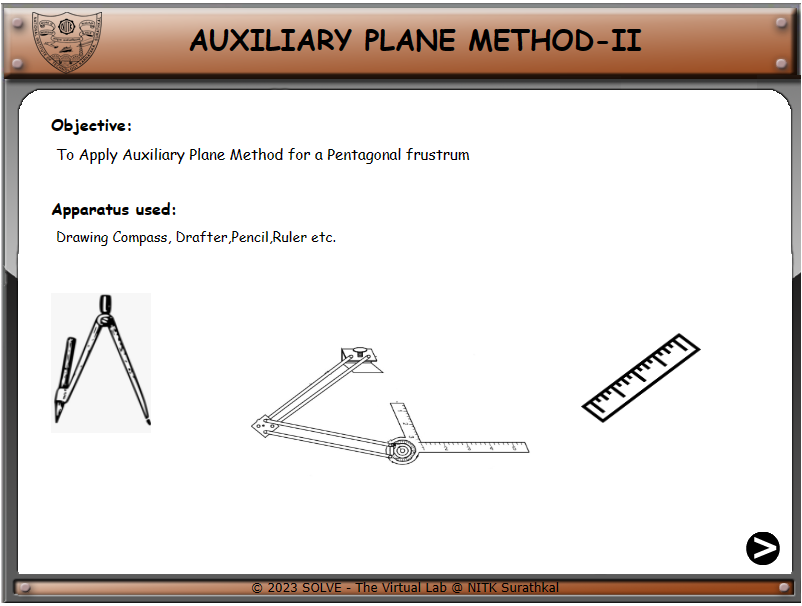
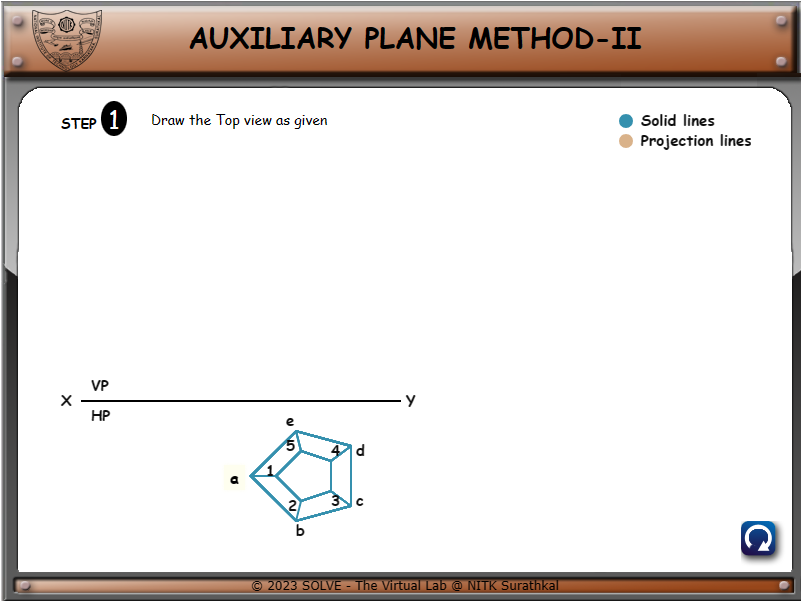
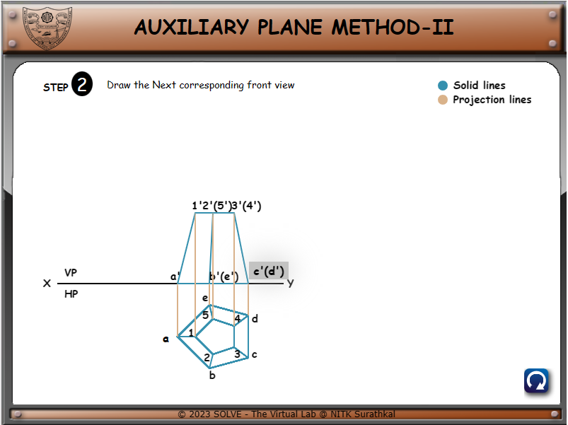
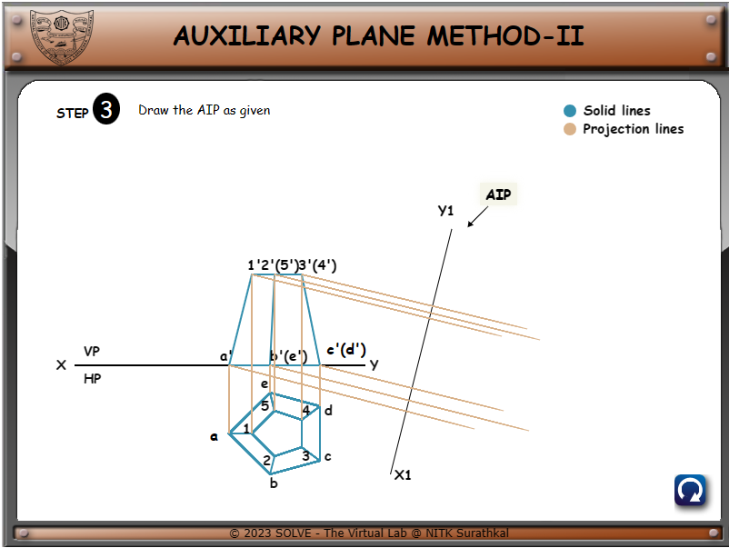
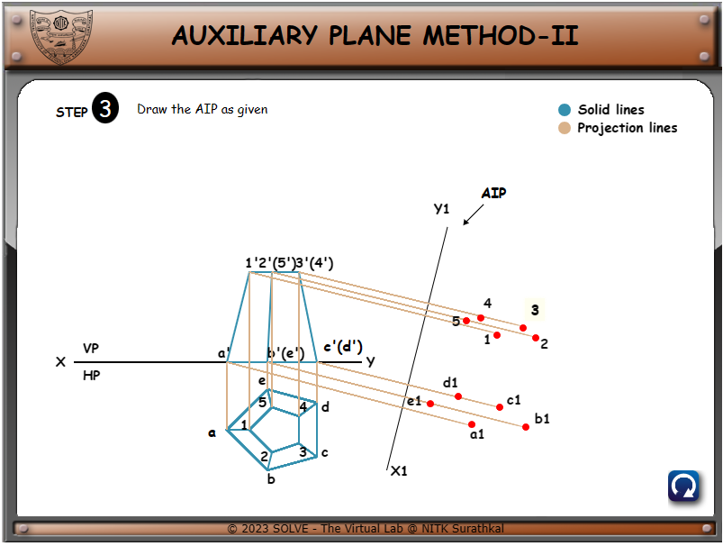
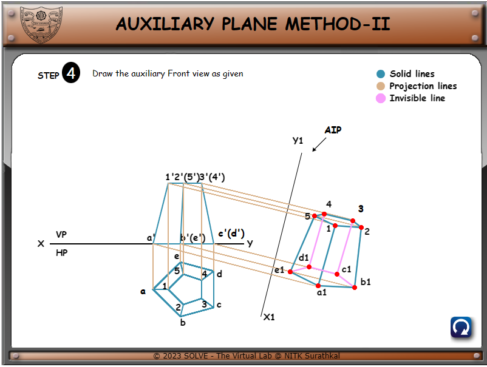

1. Clicking on the simulation tab will open the introductory page, which will give the user a list of tools used in drafting.

1. Clicking on the next button will take the user to the problem wherein a top view of a pentagonal frustum is drawn. Click on flashing ‘a’ to continue the simulator.

1. After clicking ‘a’ the front view will be shown.

1. Clicking on the flashing button c’(d’) will bring out x1 and y1 plane i.e. Auxiliary inclined plane to draw the final view.

1. Clicking on the flashing ‘AIP’ button will show the points where the edges meet.

1. Clicking on the flashing ‘3’ button will complete the problem.

